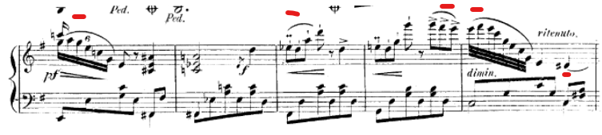

# Machine learning and musical layout

---

# A bit about me

- CEO of a Helsinki-based company called [Meeshkan](https://meeshkan.com) that mostly-legally reverse engineers software.
- We're hiring!
- Worked a lot on LilyPond and Guido about 10 years ago.
- Artistic director of [ensemble 101](https://ensemble101.fr).
- Big thanks to Werner for organizing this.

---

# What is machine learning

- Randomly generate mostly-linear equations with tens of thousands of variables.
- Construct a loss function using these equations and find its (hopefully global) minimum, using input data _and_ targets.
- Use the minimum to make predictions about new input data where we do not know the target yet.

---

# Example 1 - Linar regression.

- This is machine learning with two variables, or weights: a slope and an offeset.
- Here, we can find an analytic solution, meaning that we can solve the best possible fit without trial and error.
- In more complex problems (anything over a few dimensions), analytic solutions are not possible and you need to iterative methods to find the best solution.

---

# Example - XOR (concept)

- XOR is a binary boolean gate that yields `true` when _either_ of the inputs are true and _false_ otherwise.
    - T T -> F
    - T F -> T
    - F T -> T
    - F F -> F

- Let's watch a machine learn XOR to get a sense of what machine learning is.

---

# Example - XOR (ML)

    !python
    import numpy as np
    from keras.models import Sequential
    from keras.layers.core import Dense

    training_data = np.array([[0,0],[0,1],[1,0],[1,1]], "float32")
    target_data = np.array([[0],[1],[1],[0]], "float32")

    model = Sequential()
    model.add(Dense(16, input_dim=2, activation='relu'))
    model.add(Dense(1, activation='sigmoid'))

    model.compile(loss='mean_squared_error',
                optimizer='adam',
                metrics=['binary_accuracy'])

    model.fit(training_data, target_data, nb_epoch=500, verbose=2)
    print(model.predict(training_data).round())

---

# Why is this called _learning_?

- This is kind of how we learn.
- Some systems of equations are inspired by, but only loosely modeled on, neural networks in the brain.
- It sounds impressive.

---

# When does ML make sense?

- When there is no easily-grokable model underlying a process.
- When the process yields sensible results with few outliers.
- When there is a ton of data.

---

# Does ML make sense in musical layout?

- _Yes_.
- There is no single, unified model underlying musical layout.
- Classical engraving is hard to get right, but it is rarely shocking or unpredictable.
- There is lots of data - we know the context of elements in traditional engraving _and_ where they are placed.

---

# Case study - slurs in LilyPond

- LilyPond has over 20 exposed and 100 internal variables it uses for slur layout, many of which are interdependent in ways we don't understand.
- While LilyPond usually produces a sensible outcome, no one really gets why or how it does this. In other words, it is tantamount to a black box and more or less as opaque as machine learning.
- Slurs, in classical engraving, provide us tons of data. Using OKR, we can amass a corpus of millions of slurs' placement (_target_) and the objects influencing their placement (_input data_).
- Six different substantive authors spanning fifteen years.
- Poorly documented both for users and coders.

---

# Slurs in LilyPond 1

    !scheme
    ; scm/layout-slur.scm
    (define default-slur-details
    '((region-size . 4)
        (head-encompass-penalty . 1000.0)
        (stem-encompass-penalty . 30.0)
        (edge-attraction-factor . 4)
        (same-slope-penalty . 20)
        (steeper-slope-factor . 50)
        (non-horizontal-penalty . 15)
        (max-slope . 1.1)
        (max-slope-factor . 10)
        (free-head-distance . 0.3)
        (free-slur-distance . 0.8)
        (gap-to-staffline-inside . 0.2)
        (gap-to-staffline-outside . 0.1)
        (extra-object-collision-penalty . 50)
        (accidental-collision . 3)
        (extra-encompass-free-distance . 0.3)
        (extra-encompass-collision-distance . 0.8)
        (head-slur-distance-max-ratio . 3)
        (head-slur-distance-factor . 10)
        (absolute-closeness-measure . 0.3)
        (edge-slope-exponent . 1.7)
        (close-to-edge-length . 2.5)
        (encompass-object-range-overshoot . 0.5)
        (slur-tie-extrema-min-distance . 0.2)
        (slur-tie-extrema-min-distance-penalty . 2)
        ))

---

# Slurs in LilyPond 2

    !scheme
    ; scm/define-grobs.scm
    (Slur
     . (
        (avoid-slur . inside)
        (control-points . ,ly:slur::calc-control-points)
        (cross-staff . ,ly:slur::calc-cross-staff)
        (details . ,default-slur-details)
        (direction . ,ly:slur::calc-direction)
        (height-limit . 2.0)
        (line-thickness . 0.8)
        (minimum-length . 1.5)
        (ratio . 0.25)
        (springs-and-rods . ,ly:spanner::set-spacing-rods)
        (stencil . ,ly:slur::print)
        (thickness . 1.2)
        (vertical-skylines . ,(ly:make-unpure-pure-container ly:slur::vertical-skylines ly:grob::pure-simple-vertical-skylines-from-extents))
        (Y-extent . ,slur::height)
        (meta . ((class . Spanner)
                 (interfaces . (outside-staff-interface
                                slur-interface))))))

---

# Slurs in LilyPond 3

    !c++
    // lily/slur-configuration.cc
    Bezier
    avoid_staff_line (Slur_score_state const &state,
                    Bezier bez)
    {
    Offset horiz (1, 0);
    vector<Real> ts = bez.solve_derivative (horiz);

    /* TODO: handle case of broken slur.  */
    if (!ts.empty ()
        && (state.extremes_[LEFT].staff_ == state.extremes_[RIGHT].staff_)
        && state.extremes_[LEFT].staff_ && state.extremes_[RIGHT].staff_)
        {
        Real t = ts[0]; //the first (usually only) point where slur is horizontal
        Real y = bez.curve_point (t)[Y_AXIS];
        // A Bezier curve at t moves 3t-3t² as far as the middle control points
        Real factor = 3.0 * t * (1.0 - t);

        Grob *staff = state.extremes_[LEFT].staff_;

        Real p = 2 * (y - staff->relative_coordinate (state.common_[Y_AXIS], Y_AXIS))
                / state.staff_space_;

        int round_p = (int) my_round (p);
        if (!Staff_symbol_referencer::on_staff_line (staff, round_p))
            round_p += (p > round_p) ? 1 : -1;
        if (!Staff_symbol_referencer::on_staff_line (staff, round_p))
            return bez;

        Real const distance = (p - round_p) * state.staff_space_ / 2.0;
        // Allow half the thickness of the slur at the point t, plus one basic
        // blot-diameter (half for the slur outline, half for the staff line)
        Real const min_distance = 0.5 * state.thickness_ * factor
            + state.line_thickness_
            + ((state.dir_ * distance > 0.0)
            ? state.parameters_.gap_to_staffline_inside_
            : state.parameters_.gap_to_staffline_outside_);
        if (fabs (distance) < min_distance)
            {
            Direction resolution_dir = (distance > 0.0) ? UP : DOWN;

            Real dy = resolution_dir * (min_distance - fabs (distance));

            // Shape the curve, moving the horizontal point by factor * dy
            bez.control_[1][Y_AXIS] += dy;
            bez.control_[2][Y_AXIS] += dy;
            // Move the entire curve by the remaining amount
            bez.translate (Offset (0.0, dy - factor * dy));
            }
        }
    return bez;
    }

---

# How to make a slur dataset (the right way)

- Use OCR to identify the score elements, including slurs.
- Encode metadata if known including composer, instrument(s), engraver, date of composition, date of engraving, etc.

---

# How to make a slur dataset (my way)

- Output LilyPond slur placement coordinates to a logfile for several hundred public scores and snippets.
- Use bounding-box variables for the following grobs as **input data**:
    - Encompassed noteheads
    - Encompassed stems
    - Accidentals
    - All per-note grobs with `avoid-slur` set to inside
    - All spanners with `avoid-slur` set to inside
- Use the four anchor points for a Bezier curve as **targets**.

---

# Exmaple datum

N1X0 | N1Y0 | N1X1 | N1Y1 | S1X0 | S1Y0 | S1X1 | S1Y1 | A1X0 | A1Y0 | A1X1 | A1Y1 |
---- | ---- | ---- | ---- | ---- | ---- | ---- | ---- | ---- | ---- | ---- | ---- |
0.0  | 1.0  | 1.1  | 2.0  | 0.9  | 1.0  | 1.0  | 4.5  | 0.0  | 0.0  | 0.0  | 0.0  |

The issue with this approach is that it either requires different models for different numbers of grobs or grotesquely padded data. There are probably more nuanced ways to do this, but for the GPU I have and the size of the dataset the 0s were not problems.

---

# Tested algorithms

- Random forest
- Gradient tree boosting
- "Naive" dense neural net
- LSTM-based approach

---

# And the winner is...

---

# ... gradient tree boosting! 🎉🎊

---

# Results

Results given in average cumulative error in staff-spaces. The cumulative error is taken by adding the distances of anchor points for the bezier curve.

Random forest | Gradient boosting  | Dense | LSTM
------------- | ------------------ | ----- | ----
0.021         | 0.005              | 0.03  | 0.07

---

# Why is gradient tree boosting effective?

- I have no idea.
- In general, dense neural nets perform poorly because individual weights do not do enough work or are redundant, so they do not generalize or scale well.
- LSTMs would have been promising for _only_ sequences, but music has spanners, so more research would need to be done into a hybrid sequence/spanner model. My hunch is that they would have won had spanners been able to be properly encoded.
- Gradient boosting and random forest are generally suited more to phenomena where decisions are based on combining disparate strands of information.

---

# Gotchyas

- Circular dependencies.
- Computation time.
- Size of binary.
- Small number of people that work on this sort of thing.
- Low community enthusiasm.
- Buzzword-phobia.

---

# Further research

- I unfortunately don't have enough bandwidth in the near future to work on this.
- Would be nice to see more research in this area, happy to advise a GSoC project if anyone is interested.
- [mike@meeshkan.com](mailto:mike@meeshkan.com) | +358 40 147 1776